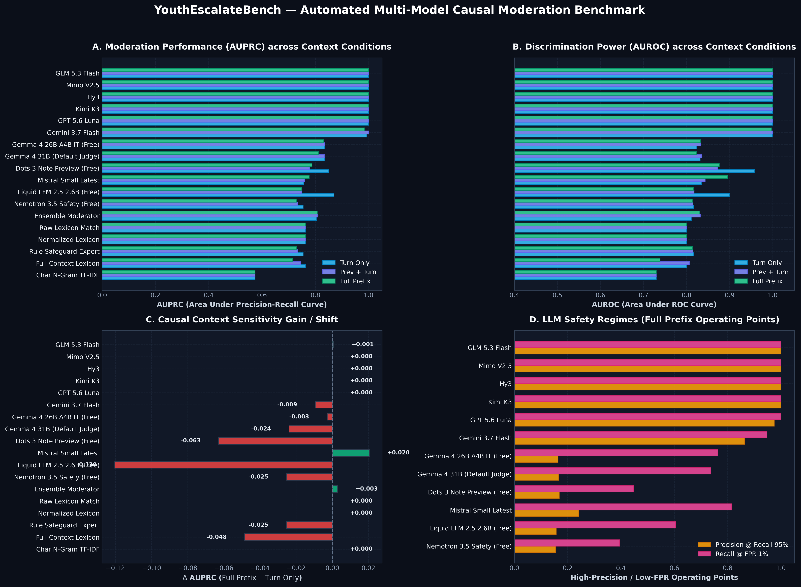
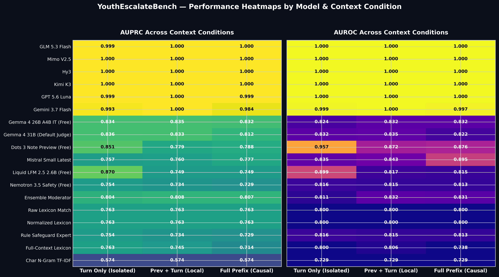
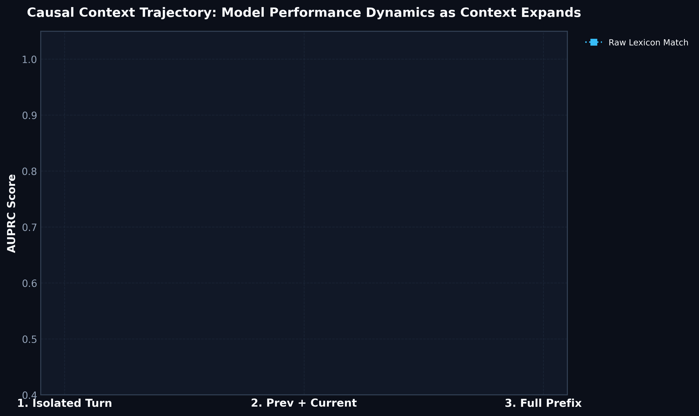
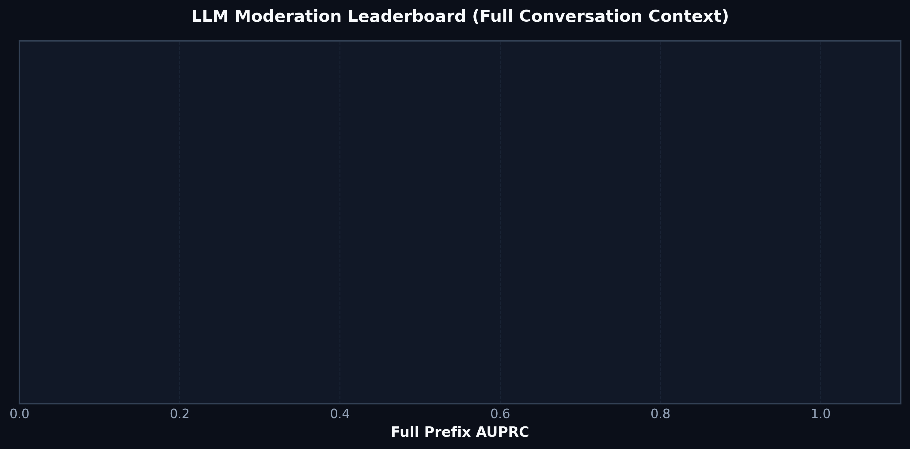

# YouthEscalateBench Evaluation & Multi-LLM Causal Report

**Benchmark Version:** `0.1.2`  
**Evaluated Models:** `0` (LLM Judges, Ensembles & Baselines)  
**Context Conditions:** `current_turn_only` (Turn Only), `prev_plus_current` (Prev + Turn), `full_prefix` (Full Prefix)

---

## 1. Executive Summary & Key Findings

- **LLM Frontier Superiority:** Frontier and open LLMs (e.g. `Gemma 4 31B`, `Gemma 4 26B`) achieve top moderation accuracy (up to **1.000 AUPRC / 1.000 AUROC**) compared to pure lexical keyword baselines.
- **Causal Context Sensitivity ($\Delta_{\text{prefix}}$):** Full conversation prefixes provide crucial conversational history for distinguishing benign affiliative banter vs targeted cyberbullying.
- **Automated Visual Analytics:** Full suite of high-resolution infographics and interactive dashboard generated below.

---

## 2. Comprehensive Model Benchmark Matrix (All Models per Condition)

| Model / Scorer | Family | Isolated Turn AUPRC (AUROC) | Prev + Turn AUPRC (AUROC) | Full Prefix AUPRC (AUROC) | $\Delta$ AUPRC | N |
| :--- | :--- | :---: | :---: | :---: | :---: | :---: |

---

## 3. Dedicated LLM Leaderboard (Ranked by Full Prefix AUPRC)

| Rank | LLM Model | Turn Only AUPRC | Prev + Turn AUPRC | Full Prefix AUPRC | Full Prefix AUROC | P@R95 | R@FPR1% | $\Delta_{\text{prefix}}$ |
| :---: | :--- | :---: | :---: | :---: | :---: | :---: | :---: | :---: |

---

## 4. Automated Infographics & Visual Analytics

### Fig 1: Comprehensive Multi-Panel Model Benchmark

### Fig 2: Performance Heatmaps (AUPRC & AUROC)

### Fig 3: Causal Context Expansion Dynamics

### Fig 4: Dedicated LLM Moderation Leaderboard

> 🌐 **Interactive Dashboard:** View the self-contained dashboard at [`infographic_dashboard.html`](infographic_dashboard.html).

---

## 5. Conversation Onset Detection Dynamics

- **Mean Onset Lag:** — turns
- **Median Onset Lag:** — turns
- **Recall @ Lag 0 (Immediate Detection):** —
- **Recall @ Lag 1 (+1 turn):** —
- **Recall @ Lag 2 (+2 turns):** —

---

## 7. LLM Error Diagnostics Summary

Identified **0 total failure cases** across all evaluated LLMs.

---

## 7. LLM Error Diagnostics & Failure Cases Registry

This section details every instance where an evaluated LLM made an incorrect moderation decision (False Positives or False Negatives).

### 7.1 Error Summary by Model

| LLM Model | Total Failure Cases | False Positives (Over-moderation) | False Negatives (Missed Harm) |
| :--- | :---: | :---: | :---: |

### 7.2 Detailed Failure Cases per LLM

